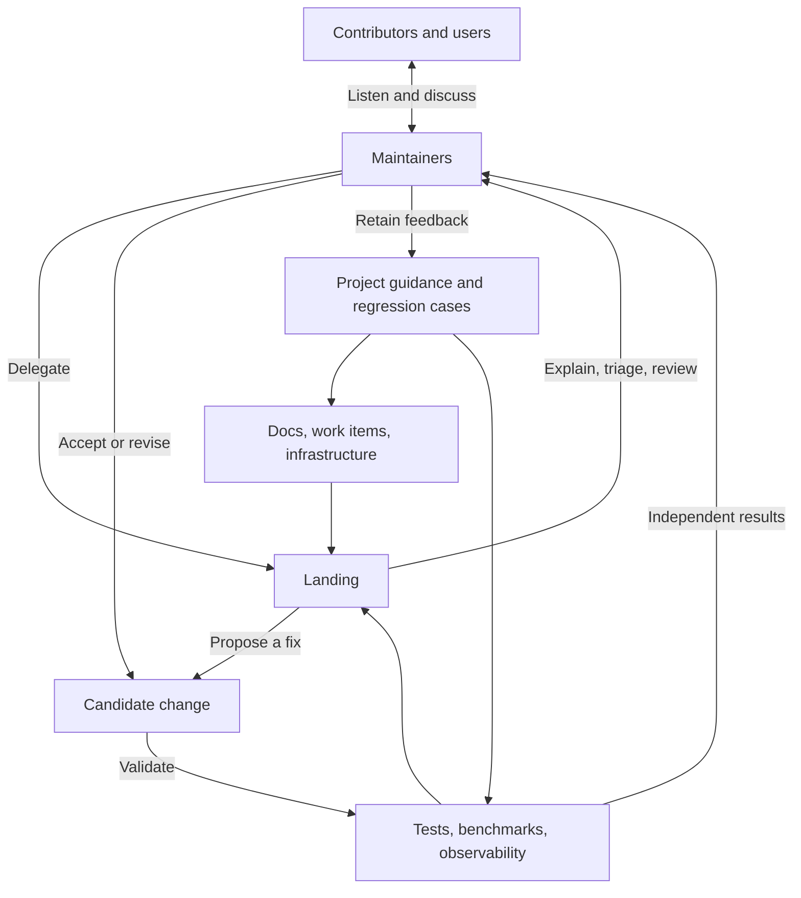

# Working with Landing

Landing can investigate failures, prepare issues, make changes, run checks, and publish reviews within the authority you give it. Reliable results depend on the engineering context your team maintains and the evidence you use to accept work.

## Connect the engineering context

Give Landing relevant documentation and work items to establish intended behavior and acceptance criteria. Infrastructure describes where the work runs. Tests, benchmarks, and observability establish what it does. Make these available through workspace files, focused snapshots, or tools in the prepared environment.

Start with the material needed for the question. Let the agent fetch a specific log or discussion when it needs more evidence. Connecting the engineering system does not require loading every document or issue into every task.



Native checks and operational signals reach maintainers directly. Landing helps them act on the same evidence. Each command works independently; the diagram does not require every task to pass through all four actions.

## Delegate a concrete task

Use `explain` for a question, `triage` to make a problem actionable, `fix` for a repair, and `review` to evaluate a candidate. State the unresolved condition, expected outcome, relevant constraints, and evidence that would settle it.

```text
Fix the documented timeout behavior. Reproduce the failure, preserve the public CLI contract, and use the existing acceptance check. Report the observed result and any remaining uncertainty.
```

Reuse an existing issue when it describes the same problem. Automatic follow-up updates it only when evidence, conditions, or verified progress change. A new run ID alone does not justify another status comment. Explicit questions still receive a reply.

## Verify the outcome

Reuse independent checks that cover the candidate and its execution environment. Identify the checked revision when it affects the conclusion; a PR head, CI merge checkout, and deployed commit can differ. Use source inspection or a focused counterexample for an unresolved question.

Keep the outcome clear: task completion, a model recommendation, a published reply, and actual recovery establish different things. An `allow` recommendation does not replace acceptance evidence. Review findings should explain a supported trigger and consequence at the useful repair location, with a short verdict when the details are inline.

Retain useful findings and mistaken assumptions in the relevant work item. Improve project guidance, tools, code, or checks where the problem belongs. Behavior tests cover the experience users see; regression tests cover actual mistakes likely to recur. See [Develop and dogfood](development.md) for Landing's own feedback loop.

## Community Over Code

A healthy community sustains a project as its code changes. [The Apache Way](https://www.apache.org/theapacheway/) describes this as Community Over Code.

Use the time saved by automation to listen to users, welcome contributions, and work through disagreements. Tools can help prepare a reply; personal thanks, empathy, and commitments need your attention. Stay involved when someone needs encouragement, clarification, or a conversation about the project's direction.

Authorized engineering tasks can run automatically, including investigation and publication. Maintain the relationships behind that work yourself. Judge the experience by whether people can make progress and remain willing to participate, as well as whether a candidate passes its checks.
