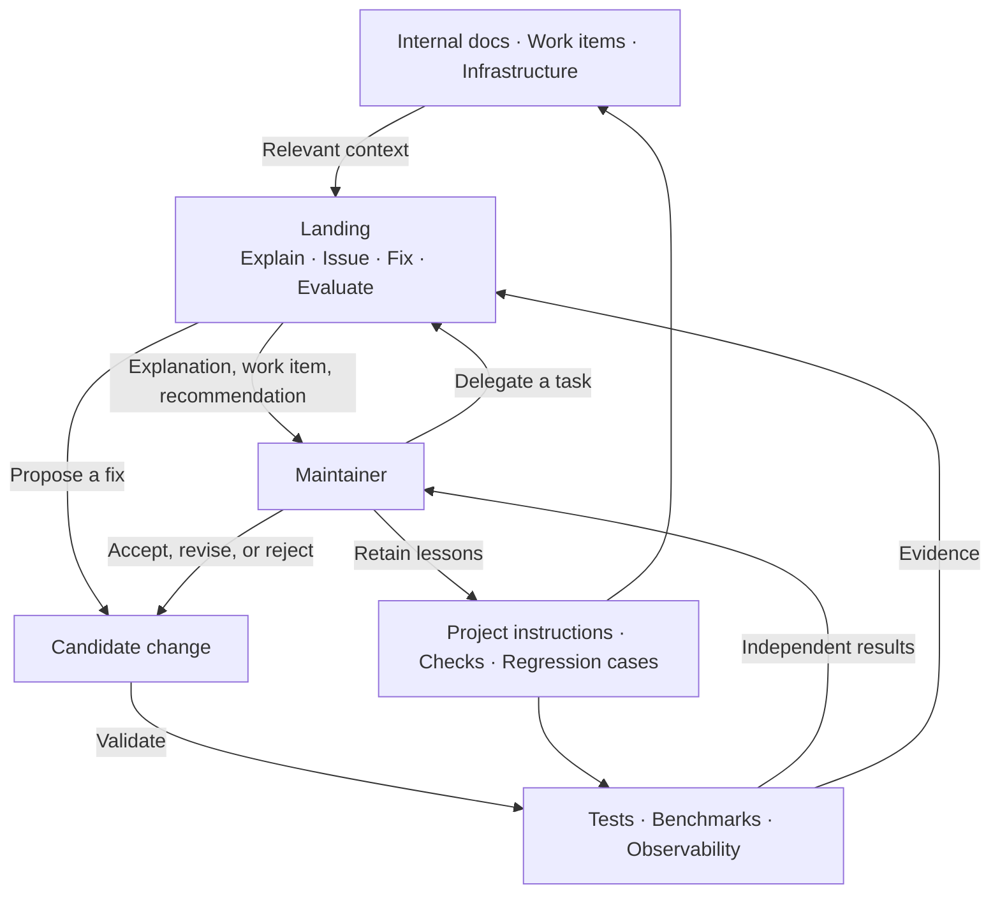

# Working with Landing

Reliable assistance depends on the context your team maintains and the evidence you use to accept work. Give Landing the system around the code: internal documentation, work items, infrastructure, tests, benchmarks, and observability.

The same method applies to a release question, a failing benchmark, a documentation problem, or a code change. Delegate a concrete task, give it relevant evidence, validate the result independently, and retain what you learn.

## Connect the engineering context

| Source | What it helps establish | How to supply it |
| --- | --- | --- |
| Internal documentation | Intended behavior, architecture, operating procedures | Workspace files, `AGENTS.md`, or text snapshots with `--input`. |
| Work items | The problem, owner, prior attempts, acceptance criteria | An issue snapshot or the optional scoped `gh` tool. |
| Infrastructure | Deployment environment, configuration, release topology | Relevant manifests and sanitized command output. |
| Tests | User-visible behavior and known regressions | Existing check commands and failure logs. |
| Benchmarks | Performance expectations and measured changes | Baseline and candidate reports with environment and revision details. |
| Observability | What happened in the running system | Relevant logs, metrics, and traces with time range and deployed revision. |

Supply the material needed for the task. A complete engineering system does not mean attaching every document to every request. Start with files, snapshots, and tools your team already uses. Add an integration when real work shows what is missing. Landing does not automatically connect these systems for you.



Native checks and operational signals reach maintainers directly. Landing uses the same evidence to help them act. A proposed change goes through validation again. These arrows describe collaboration over time, not an automatic pipeline that invokes every mode.

## Make a problem actionable

Use `issuer` when a finding needs an owner and acceptance criteria. A useful work item explains the expected behavior, the observed failure, how to reproduce it, and what would demonstrate recovery. Reuse an existing issue for the same problem and preserve evidence of recurrence.

```text
Investigate the failed release check. Determine whether this is a product defect,
a broken check, or an infrastructure failure. Reuse an existing issue if it
describes the same problem. Include the failing revision and acceptance criteria.
```

Issue creation requires an authorized platform tool. Without one, issuer returns text that you can use in your own work system.

## Delegate against acceptance

Use `fixer` for a defined problem. State the intended user behavior, relevant constraints, and how to verify it. Provide project instructions and the commands that matter. Keep the candidate in a workspace you can inspect.

```text
Fix the documented timeout behavior. Reproduce the failure, preserve the public
CLI contract, and use the existing acceptance check. Report actual validation and
anything that still needs a human decision.
```

Fixer edits the selected workspace. The GitHub event runner prepares a separate worktree and owns publication; ordinary CLI usage leaves edits in place. The runner executes required checks independently of the agent's claims.

## Review the evidence

Use `gatekeeper` to evaluate a candidate and `explainer` to answer a question. Both need evidence with enough provenance to support the conclusion. Identify the diff revision, the revision checked by CI, and the deployed revision when discussing recovery. A PR head and a CI-tested merge commit can be different.

```text
Review the candidate against the issue's acceptance criteria. State which
revision each check covers. Separate verified behavior, hypotheses, and missing
evidence. Recommend the next discriminating check when the cause is uncertain.
```

Keep execution status, model recommendation, native check results, platform delivery, and human acceptance distinct. An action can complete with a block recommendation. A successful reply can contain mistaken advice. A merged PR does not establish production recovery.

## Retain feedback where the team works

Record useful findings, mistaken assumptions, rejected repairs, human edits, and operational results in the relevant work item. Use those cases to improve project instructions, tools, checks, or the implementation at the layer that owns the problem.

Keep behavior tests for the experience users see and regression tests for actual mistakes likely to recur. End-to-end acceptance is valuable for platform wiring. Avoid tests that freeze helper structure or repeat simple implementation details. A rewrite preserving the user's experience should still satisfy the contract.

Judge adoption by whether people can act more effectively: an explanation points to a useful next check, an issue has actionable acceptance, a repair survives independent validation, and incorrect advice is easy to identify and correct. Do not use the model's own recommendation as its quality score.

See [Develop and dogfood](development.md) for how Landing uses this process on its own issues, checks, and candidate PRs.
